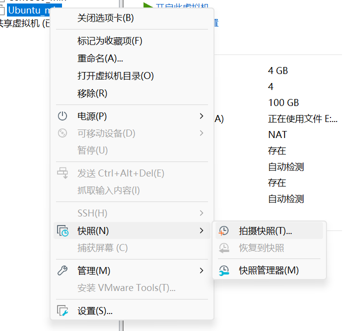
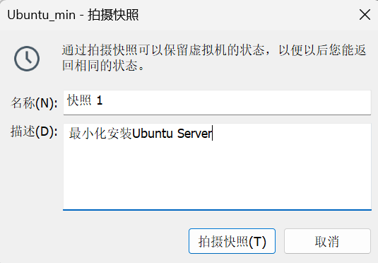
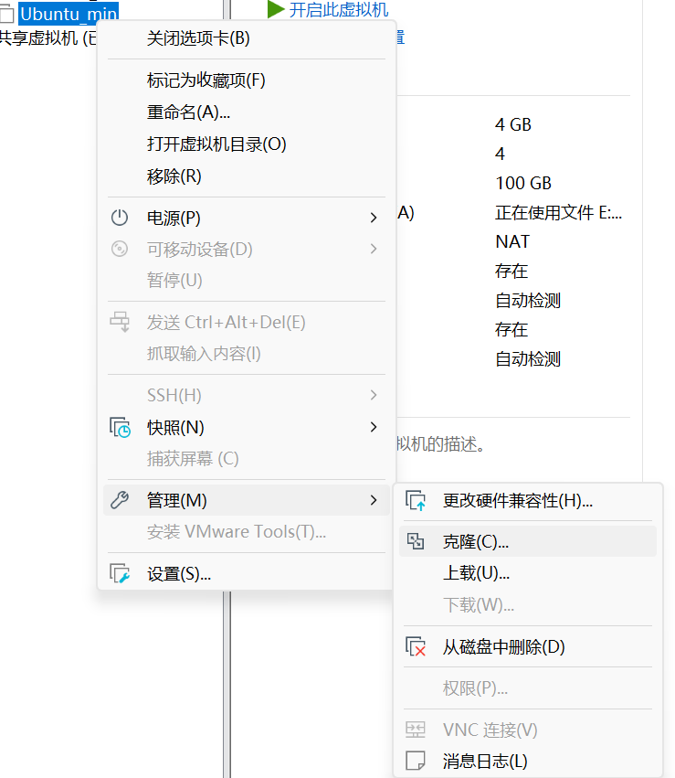
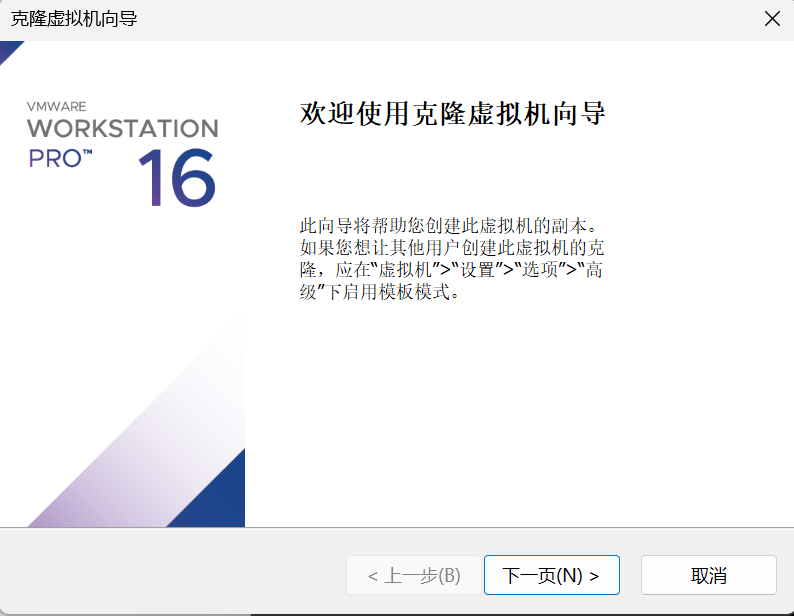
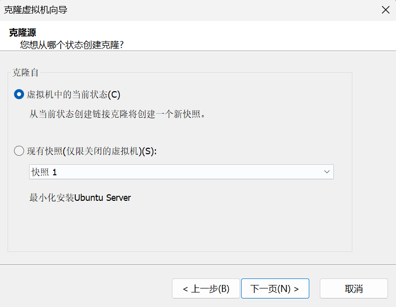
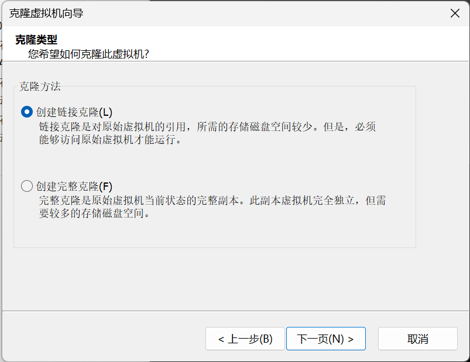
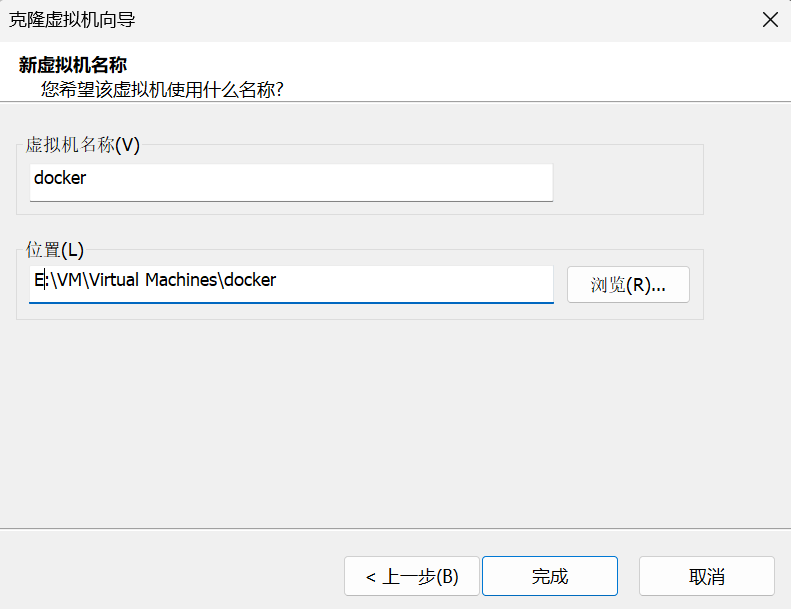
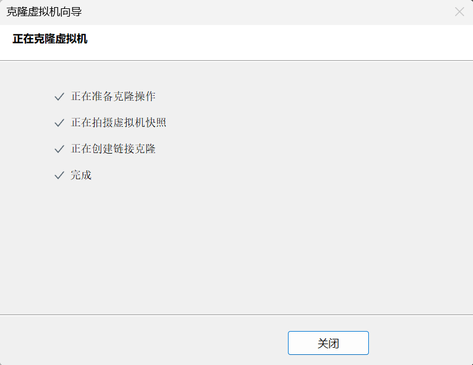
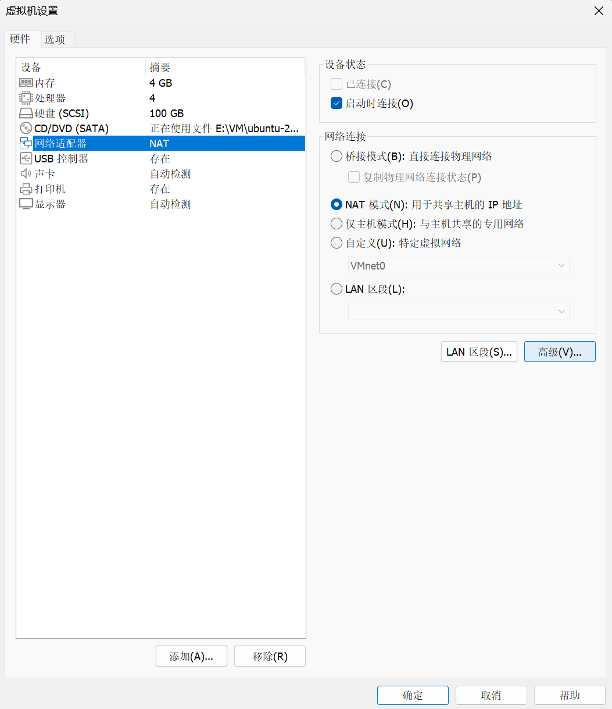
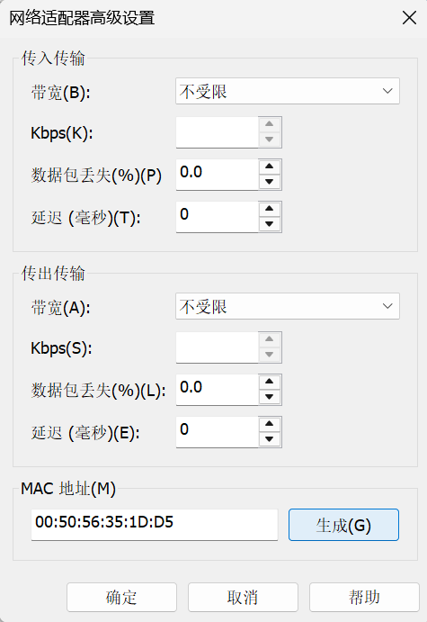

# 快照和克隆

## 1. 快照

右键虚拟机选择快照，点击拍摄快照；填写名称和描述后点击拍摄快照即可。





## 2. 克隆虚拟机

右键虚拟机选择管理，点击克隆。



弹出的页面继续点击“下一页”。



选择“虚拟机中的当前状态”，点击“下一页”。



选择“创建链接克隆”，点击“下一页”。



自定义虚拟机的名称以及选择要存储系统的位置，点击“完成”。



根据自己电脑的实际配置情况，选择处理器数量和核数，这里以 2*3 为例，随后点击“下一步”。



选择刚刚创建的虚拟机设置，点击“网络设配器”，随后点击“高级”。



在 MAC 地址，点击“生成”、点击“确定”、点击“确定”。



开机登录，修改 IP

```bash
sudo vim /etc/netplan/xxx.yaml
写入一下配置
# This is the network config written by 'subiquity'
network:
  ethernets:
    ens33:
      addresses:
        - 192.168.93.136/24
      nameservers:
        addresses: [114.114.114.114, 8.8.8.8]
      routes:
        - to: default
          via: 192.168.93.2
  version: 2
```

保存后退出。

使用以下命令更新设置

```bash
sudo netplan apply
```

查看 IP 是否变化

```bash
ip a
```

克隆完成！